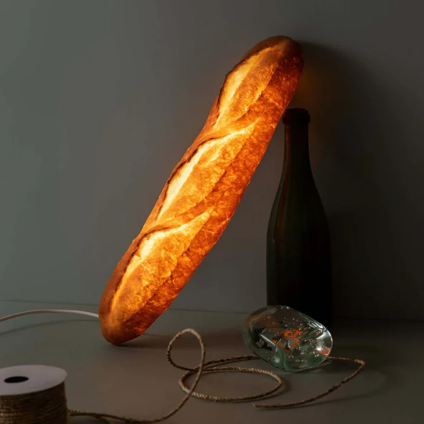
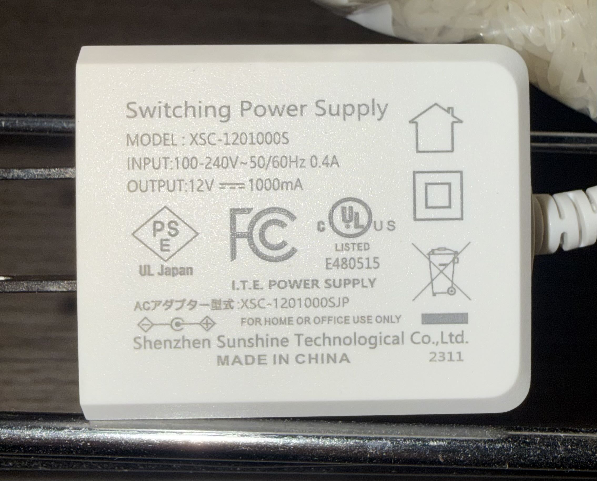
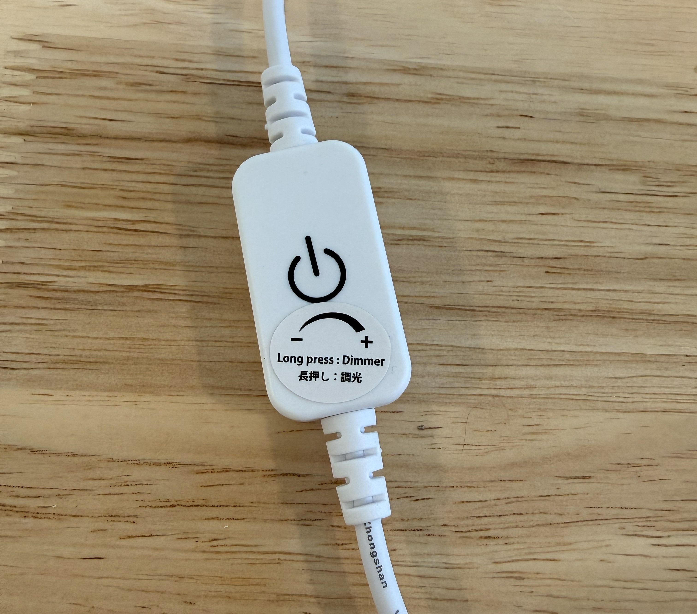
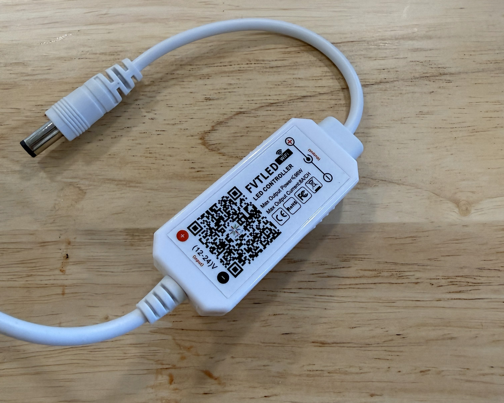
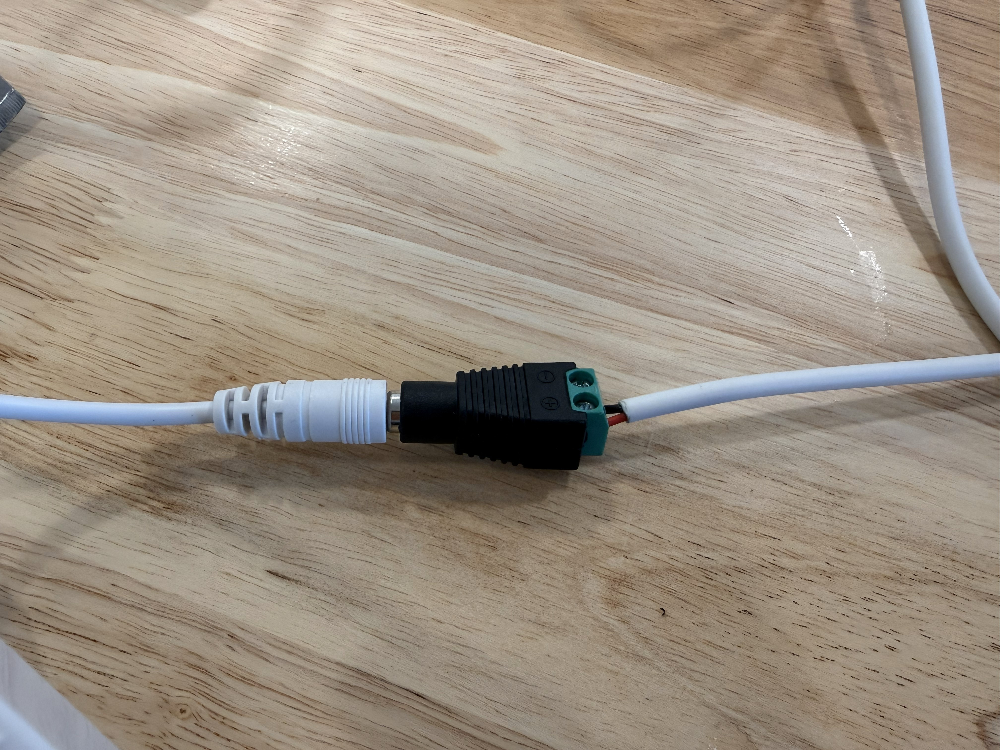

This is my first post so I will write about a simple project.

## The Lamp

I received the [Pampshade bread lamp](https://shop.yukikomorita.com/en/products/pampshade0057) as a gift at the end of last year. It is an artisanal lamp created by a Japanese artist who hollows out real bread, covers it in an antibacterial resin, and adds warm white LEDs to make it light up. It was pretty expensive but is unique and it combined my enthusiasm for baking and lamps. 

<figure>
      
    <figcaption> The bread lamp in question.</figcaption>
</figure>  

The lamp is powered by a 12V power supply that plugs into a dimmer switch, which turns the lamp on/off when tapped and adjusts the brightness when held. 

<figure>
      
    <figcaption> The 12V 1A power supply that came with the lamp.</figcaption>
</figure>  

<figure>
      
    <figcaption> The built-in touch dimmer.</figcaption>
</figure>  

## Home Assistant Integration

I integrated the lamp into Home Assistant using a smart plug, but there was a delay of a second or two between turning on the smart plug and the lamp turning on. I also couldn't control dimming through Home Assistant. Since the dimmer is inline, I thought I might be able to replace it with a smart version that would give me digital control over dimming. I found [this product](https://a.co/d/eq9IkCa) which is Wi-Fi and compatible with Magic Home (which has a local Home Assistant integration). I would have preferred to get something with Matter-over-Thread but this product category is probably a bit too niche. I believe there are Zigbee versions too but I do not have a Zigbee coordinator set up. 

<figure>
      
    <figcaption> The new dimmer with Wi-Fi.</figcaption>
</figure> 

It was simple to replace the dimmer. On the power supply side I simply disconnected the barrel jack from the old dimmer and plugged in the new one. The old dimmer was directly connected to the lamp so I had to cut the wire on that side, strip the wires, and attach a barrel jack connector to connect to the new dimmer.  

<figure>
      
    <figcaption> The connection on the lamp side.</figcaption>
</figure> 

I then plugged the power supply back in and searched for the device in the Magic Home app. I onboarded it using Bluetooth and entered my Wi-Fi credentials, then the device showed up in the devices page in Home Assistant. It has worked reliably since. It responds quickly and I added the lamp to [adaptive lighting](https://github.com/basnijholt/adaptive-lighting) so that it adjusts brightness automatically. 

<figure>
      
    <figcaption> Bread lamp changing brightness. </figcaption>
</figure> 

Thanks for reading! 