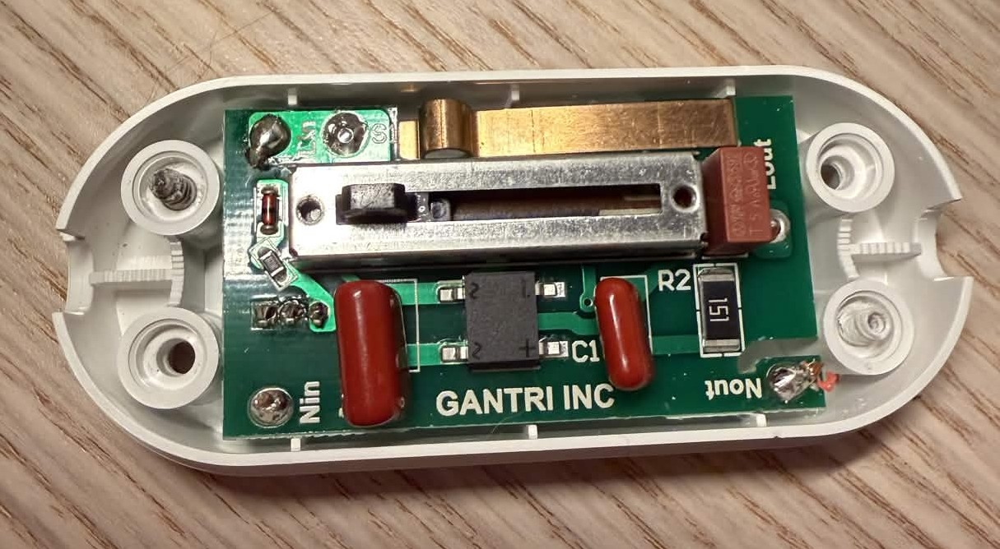

<figure>
      
    <figcaption> The Gantri Cantilever light. </figcaption>
</figure>

I am a fan of [Gantri](https://www.gantri.com/) lamps. They are 3D-printed with PLA and have modern designs. There are now multiple companies producing 3D-printed lamps ([Wooj](https://wooj.design/), [Terralabs](https://terralabs.design/), [others](https://all3dp.com/1/the-big-business-of-3d-printed-lamps/)) that advertise the sustainability aspect of additive manufacturing. 

Gantri lights come with a dimmer that looks sleek but is not the most practical. It does not dim very low and gives an abrupt transition from off to on as a result. I also prefer to automate all of my lights with smart bulbs for more flexibility and syncing with other lights. Gantri [previously](https://web.archive.org/web/20240911025424/https://www.gantri.com/products/10047/cantilever-table-light-by-louis-filosa?sku=10047-sm-sunrise) advertised their lamps as compatible with Hue White and Color bulbs but has removed that mention. I have tried using the "Gen 3.1" Hue bulbs in Gantri lamps with success, but they are very expensive and are Zigbee-only. 

I assumed that other smart bulbs would also work with the lamps, but it is surprisingly challenging to find one that works on dimmer circuits. I have listed the bulbs I have tested below. It seems that some bulbs have more robust power electronics that can handle the noise from dimmers. The Aqara T2 bulb and Hue White and Color bulbs are heftier than the Nanoleaf Essentials and Hue Essential bulbs. Unfortunately, the Aqara T2 bulb was fickle and would not stay connected to my Thread network. After trying to reset it a few times I had to return it. I was surprised that the newer Hue White and Color Ambience bulb did not work. It works normally at lower brightnesses but it flashes at higher brightnesses. The brightness threshold varies by color temperature, which suggests that it has issues when the power draw exceeds a certain value. 

| Bulb                                                                                | Compatibility | Notes                                                                       | Price  | Protocols                     |
|-------------------------------------------------------------------------------------|---------------|-----------------------------------------------------------------------------|--------|------------------------------|
| [Philips Hue White and Color Ambience "Gen 3.1"](https://www.amazon.com/dp/B07R1NMLL4)                                      | ✅           | Works normally                                                              | ~$60   |                        |
| [Philips Hue Essential A19 E26](https://www.philips-hue.com/en-us/p/hue-white-and-color-ambiance-essential-a19-e26-smart-bulb-800-lm-88w-4-pack/046677592592)                                                       | ❌            | Flashes at brightness above ~80%                                                                     | $15    |    |
| [Philips Hue White and Color Ambience 1100 lm (Matter, Chromasync)](https://www.philips-hue.com/en-us/p/hue-white-and-color-ambiance-75w-a19-e26-smart-bulb/046677591168) | ❌            | Flashes at brightness above ~80%                                            | ~$51.99 |    |
| [Nanoleaf Essentials Matter A19 E26](https://us-shop.nanoleaf.me/products/matter-thread-a19-smart-bulb-each)                                                  | ❌            | Flashes                                            | $16.67 |                        |
| [Aqara LED Bulb T2 RGB CCT](https://us.aqara.com/products/led-bulb-t2-e26)                                                         | ✅           | Works normally, but bulb is unreliable and stops responding every few hours | $20.99 |              |

I ended up removing the dimmer from the lamps. The dimmers seem to be custom-designed with the PCBs having the Gantri logo. I desoldered the wires and reattached them to a [$5.29 standard inline on/off switch](https://a.co/d/06rlVMju). The lamps are now compatible with any smart bulb. This ended up being more cost-effective than trying to find the rare smart bulb that can handle a dimmer.  

<figure>
      
    <figcaption> The inside of a Gantri dimmer. </figcaption>
</figure>