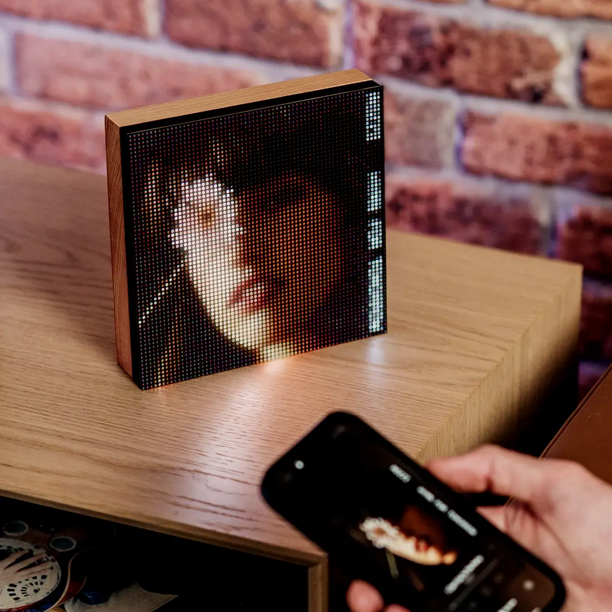

[Tuneshine](https://www.tuneshine.rocks/) is a product that displays the album artwork of the currently playing song on a 64x64 matrix. I wanted to a make a version of it that plays the music video instead.

<figure>
      
    <figcaption> A Tuneshine device. </figcaption>
</figure>

## Hardware
I have an [Adafruit Matrix Portal S3](https://www.adafruit.com/product/5778), an ESP32-S3-based microcontroller designed for HUB75 matrices. It's currently paired with the [32x32 LED matrix](https://www.adafruit.com/product/607) from Adafruit. It's only 0.25x the resolution of the 64x64 matrix, so videos are very blurry. I am considering getting a 64x64 matrix.

All the processing happens in Home Assistant on Home Assistant Operating System, which is running inside a proxmox VM on an Intel NUC6i7KYK. The VM has 6 GB of RAM. 

## Software
### ESP32-S3
The ESP32-S3 runs [WLED-MM](https://github.com/MoonModules/WLED-MM). I used the binary from the [Adafruit website](https://learn.adafruit.com/matrix-portal-stained-glass-with-wled/install-wled-moonmodules) and their webSerial flashing tool because I had a lot of trouble with flashing using binaries from other sources. I set up WLED with my Wi-Fi network following the normal setup procedure. 

### Home Assistant
Claude Sonnet 5 helped create the initial version of the automation through [HA-MCP](https://github.com/homeassistant-ai/ha-mcp).

#### Currently Playing Media
The automation is triggered when the currently playing title on the Sonos Era 100 changes. The automation only runs if the source is AirPlay and an input boolean for this system is switched on. 

#### YouTube Search
I set up a RESTful command action that queries the Google API for a YouTube video. It only returns one result since I can only play one video for each song. It requires a Google API key. 

  
RESTful Commands in configuration.yaml

    <pre><code>

    rest_command:
        youtube_search:
            url: "https://www.googleapis.com/youtube/v3/search?part=snippet&type=video&maxResults=1&fields=items(id/videoId)&q={{ query | urlencode }}"
            method: GET
            headers:
                x-goog-api-key: YOUR_GOOGLE_API_KEY
      
        matrix_play:
            url: "http://localhost:8787/play"
            method: POST
            content_type: "application/json"
            payload: >-
            {"video_url": "{{ video_url }}", "cache_key": "{{ cache_key }}"}

        matrix_stop:
            url: "http://localhost:8787/stop"
            method: POST
</pre></code>

  

In the automation, the action is called and the query is the `media_artist` and `media_title` from the Sonos Era 100 media player. The result is saved in a response variable which contains the `videoId` for the search result. This action is only called if the song is not already in the cache, which the automation checks by calling the `cached` action. 

#### Stream to Matrix
I created a [Home Assistant App](https://github.com/kenm00/ha-matrix-video) that streams a video downloaded from YouTube through [yt-dlp](https://github.com/yt-dlp/yt-dlp) via DDP to the WLED matrix. This app was entirely created with Claude Sonnet 5 so I cannot vouch for its reliability. 

The `matrix_play` and `matrix_stop` actions in the Restful Commands code above are used to send commands to the app to stream a video and stop the stream, respectively. In the automation, the `videoId` is appended to the YouTube URL for the `video_url` parameter. The app also looks for a cached video and plays directly from the cache if it is available. 

  
Home Assistant Automation

    <pre><code>
    alias: 'Matrix: search + play video for current Sonos track'
    description: >-
    Checks the matrix add-on's cache first; only searches YouTube on a cache miss.
    Skips the search and stops cleanly if the daily YouTube quota is already
    exhausted, or if the search returns no results.
    triggers:
    - attribute: media_title
        entity_id: media_player.kitchen
        trigger: state
    conditions:
    - condition: state
        entity_id: media_player.kitchen
        state: playing
    - condition: switch.is_on
        options:
        behavior: any
        for: '00:00:00'
        target:
        entity_id: input_boolean.matrix_music_video
    actions:
    - variables:
        cache_key: >-
            {{ (state_attr('media_player.kitchen', 'media_artist') | default('')) ~
            '_' ~ (state_attr('media_player.kitchen', 'media_title') | default(''))
            }}
    - action: rest_command.matrix_check_cache
        data:
        cache_key: '{{ cache_key }}'
        response_variable: cache_check
    - else:
        - condition: state
            entity_id: input_boolean.youtube_quota_exceeded
            state: 'off'
        - action: rest_command.youtube_search
            data:
            query: '{{ cache_key }}'
            response_variable: yt_response
        - if:
            - condition: template
                value_template: '{{ yt_response[''content''].get(''error'') is not none }}'
            then:
            - action: input_boolean.turn_on
                target:
                entity_id: input_boolean.youtube_quota_exceeded
                data: {}
            - stop: YouTube quota exceeded
        - condition: template
            value_template: >-
            {{ yt_response['content'].get('items') and
            (yt_response['content']['items'] | length > 0) }}
        - action: rest_command.matrix_play
            data:
            cache_key: '{{ cache_key }}'
            video_url: >-
                https://www.youtube.com/watch?v={{
                yt_response['content']['items'][0]['id']['videoId'] }}
        if:
        - condition: template
            value_template: '{{ cache_check[''content''][''cached''] }}'
        then:
        - action: rest_command.matrix_play
            data:
            cache_key: '{{ cache_key }}'
            video_url: ''

</pre></code>

  

<figure>
      
    <figcaption> The matrix playing a music video. </figcaption>
</figure>

## Limitations
Only 100 new songs can be displayed per day because the Google API limits YouTube search queries to 100 per day. This becomes less of a concern as more videos are stored in the cache, but the videos can take up substantial space. 

New videos start playing around 5-8 seconds after the song switches. Cached videos play immediately. 

Only the center square of the video is shown in the matrix. I think this looks better than squeezing the video into the square. 

## Why do this?
I wanted to see if it's possible. The video is more distracting than static album art, but it's cool that this can be done. 