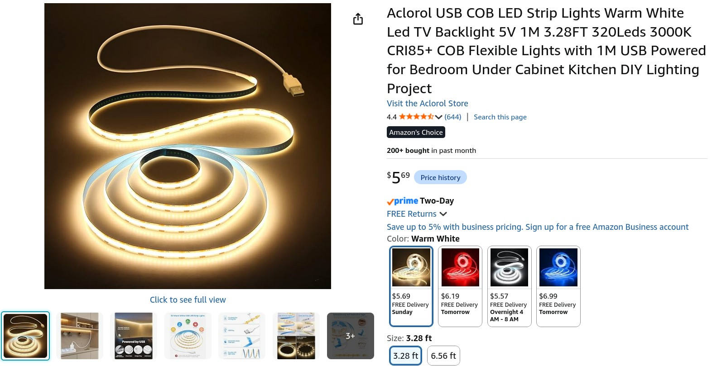
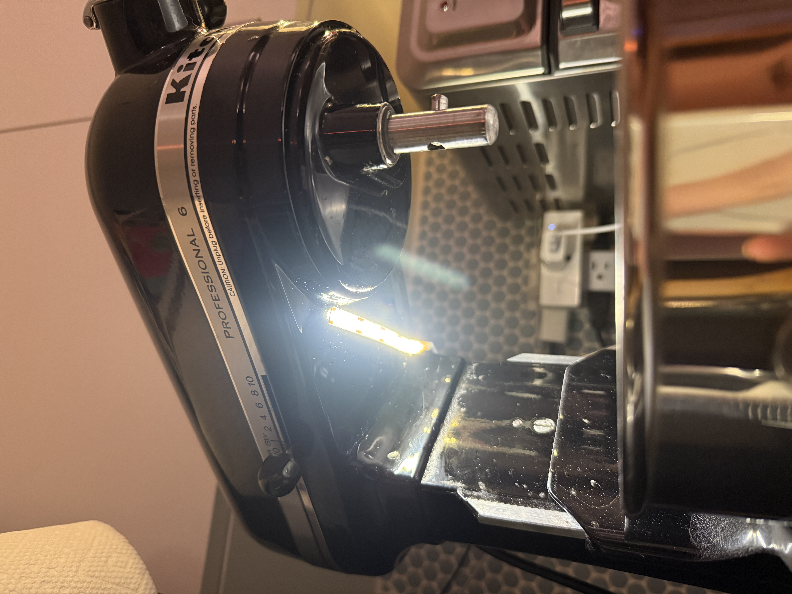
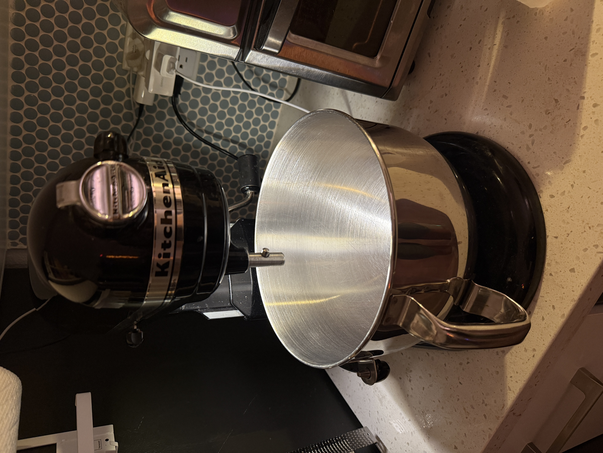

Earlier this year KitchenAid announced their new [Artisan Plus stand mixer](https://www.kitchenaid.com/countertop-appliances/stand-mixers/tilt-head-stand-mixers/artisan-plus). One of its new features is an integrated bowl light. This feels like an overdue and obvious feature, but one that I hadn't thought of before. I would like a bowl light but don't want to spend $600, and my second-hand Professional 600 Series stand mixer still works well. 

I researched options for adding a bowl light to my mixer. Someone had added a [simple light](https://www.reddit.com/r/Kitchenaid/comments/1kxsm7q/my_mixer_light/) to their mixer. I decided to go with a COB light strip for its low profile and diffused appearance. A simple option from [amazon](https://a.co/d/0iWXXz6d) (1 meter, 3000K, non-dimmable, USB-A powered) is only $5.69. 

<figure>
      
    <figcaption> The light strip I purchased. </figcaption>
</figure>

The light strip is trimmable, so I cut it to around 4 inches. I saved the remaining length for another project (it just needs a 5V power source). I used the adhesive backing on the strip to attach it to the underside of the mixer above the bowl. It has stayed put. 

<figure>
      
    <figcaption> The installed light strip. </figcaption>
</figure>

To control the light I connected it to a USB-A adapter plugged into a spare Wemo Mini smart plug. Cloud services and app support for Wemo devices was killed by Belkin, but I revived the device using [PyWeMoGUI](https://github.com/ThatStella7922/PyWeMoGUI) to connect it to my home network and control it using Home Assistant's built-in Belkin WeMo integration. Local control is very important. I added the smart plug to my existing lighting automations for the kitchen area, so it turns on when presence is detected.

<figure>
      
    <figcaption> The final result. </figcaption>
</figure>