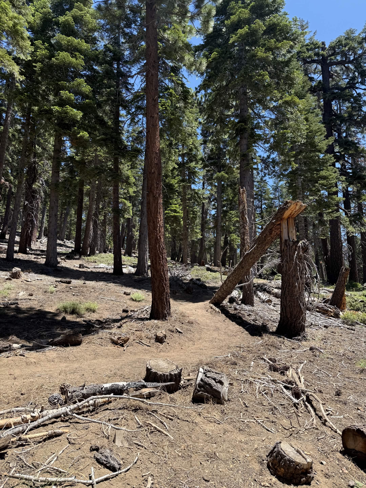
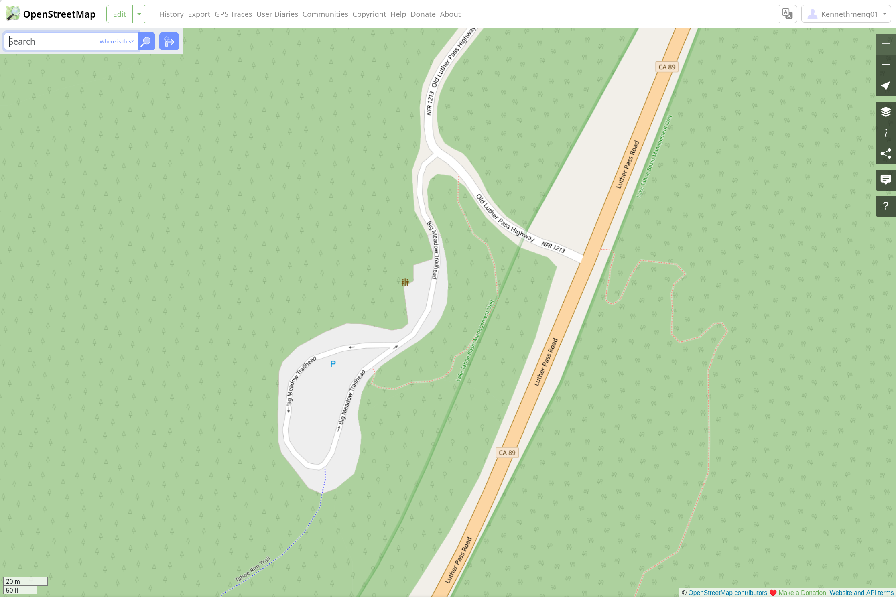

I recently volunteered to do trail work on the Tahoe Rim Trail (TRT). The crew created a short trail to allow hikers to bypass the parking lot. I asked the crew leader how they update the map to include the trail and they said that updates just show up. 

<figure>
      
    <figcaption> Another trail that we worked on (not the new trail). </figcaption>
</figure>

This prompted me to ask Claude about the process for updating OpenStreetMap (OSM) and it is surprisingly simple. I added the trail to OSM following the steps below. 

## 1. Record GPX Track
The first step is to record the trail with a GPX track. I wanted to use my iPhone 16 Pro since it supports dual-frequency GPS for improved accuracy. I downloaded the [OsmAnd](https://osmand.net/) app but could not figure out how to record a track in the limited time I had after working on the trail. I ended up using the existing WorkOutDoors app on my Apple Watch Series 9 (which lacks dual-frequency GPS) to record myself walking the trail. I exported the track as a GPX file. 

## 2. Create OSM Account
I created an account on OpenStreetMap.org. 

## 3. Add the Trail using iD
iD is the default editor for OSM and runs on the web. I dragged my GPX file into the editor and it showed up as a reference layer. I then used the line tool to trace over the reference and connected the trail to the existing roads. I set the trail as a dirt path. Then I clicked save and uploaded the changes to OpenStreetMap. 

## 4. Success

<figure>
      
    <figcaption> OpenStreetMap showing the new trail. </figcaption>
</figure>

My changes showed up in OpenStreetMap after a few minutes, but initially only in the CyclOSM layer. Now it is also visible in the default view. It appears that the different map layers are updated at different frequencies. As of 07/03/2026 (edit was made on 06/27/2026) the new trail has not yet showed up in Apple Maps or WorkOutDoors, but I expect these to show it soon. 